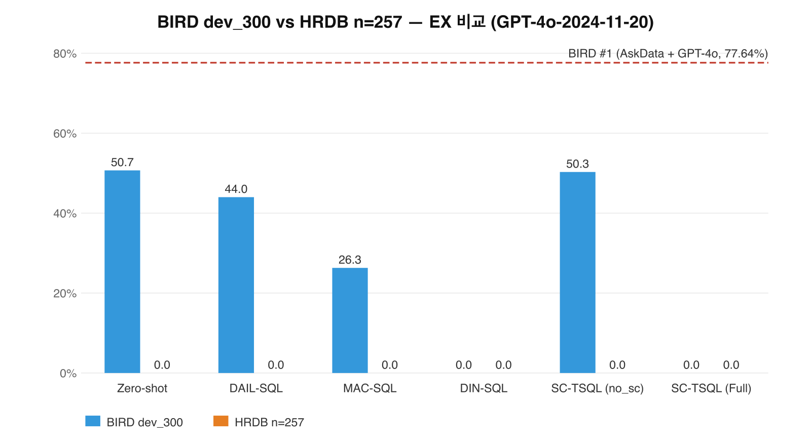
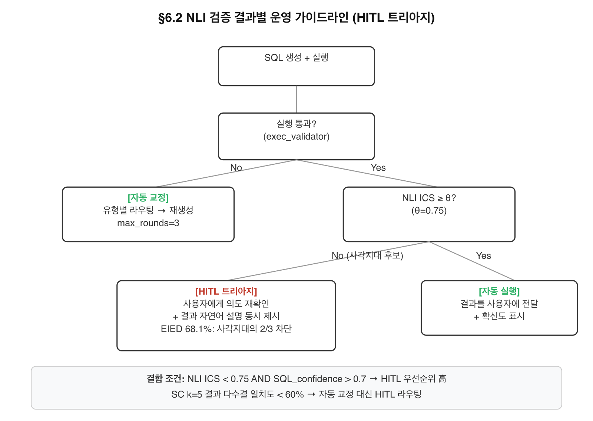
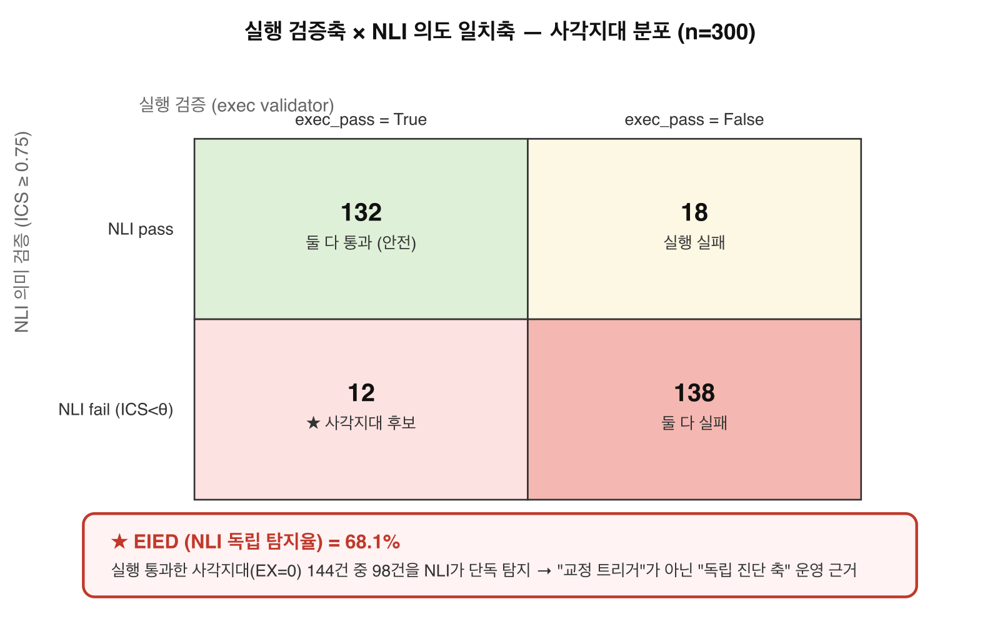

# 비전공자의 기업 데이터 접근을 위한 자가 보정 Text-to-SQL 프레임워크 SC-TSQL

**A Self-Correcting Text-to-SQL Framework for Non-Expert Enterprise Data Access (SC-TSQL)**

**저자**: 박진혁 **소속**: 국민대학교 소프트웨어융합대학원 **투고**: 한국IT서비스학회 춘계학술대회

---

> **Abstract**
> 
> Korean enterprises increasingly rely on relational databases for HR, finance, and operations data, yet non-technical users such as HR managers must depend on IT departments or pre-built dashboards to access this information through SQL. Recent advances in Large Language Model (LLM) based Text-to-SQL have reduced the syntactic barrier, but generated queries still fail in roughly one in three cases, and many failures look plausible at execution time while diverging from the user's intent. This study proposes Self-Correcting Text-to-SQL (SC-TSQL), a five-stage pipeline composed of Schema RAG, NL2SQL, Validator, Error Classifier, and Executor. The Error Classifier identifies SQL generation errors into five categories — Schema, Join, Condition, Aggregation, and Logic — and the system applies error-type-specific dynamic Retrieval-Augmented Generation (RAG) injection for correction. We demonstrate the framework on a synthetic HR database with a non-expert user persona, showing how natural-language queries are transformed into SQL through self-correction. Quantitative validation on a stratified BIRD dev sample (n=300, GPT-4o-2024-11-20) reports 50.3% Execution Accuracy, comparable to a strong zero-shot baseline and exceeding lightweight reimplementations of DAIL-SQL and MAC-SQL on the same backbone. We discuss implications for Korean enterprises adopting LLM-based data access, including governance, the operational value of dual verification axes, and guidelines for safe deployment to non-expert users.
> 
> **Keyword**: Natural Language to SQL, Retrieval-Augmented Generation, Self-Correcting LLM, Enterprise Data Accessibility, Human Resource Information System

---

## 1. 서 론

### 1.1 연구 배경

한국 기업의 디지털 전환이 가속화되면서 사내 데이터의 즉시 조회·분석 수요가 빠르게 늘고 있다. 인사·재무·운영 등 핵심 업무 데이터의 대부분은 관계형 데이터베이스에 저장되어 있고, 이를 활용하기 위해서는 SQL 작성이 필요하다. 그러나 현업 실무자 대부분은 SQL 전문가가 아니며, 단순 조회 한 건을 위해서도 데이터 분석 조직이나 IT 부서에 의존해야 하는 병목이 상존한다. 이를 우회하기 위해 한국 기업은 통상적으로 현업 요구마다 별도의 조회 화면, 리포트, BI 대시보드를 신규 개발해 왔다.

이 사전 개발 방식은 세 가지 구조적 한계를 가진다. 첫째, 한 화면 개발에 평균 수 주에서 수 개월이 소요되어 요구사항 변화 속도를 따라잡지 못한다. 둘째, 신규 질의 한 건마다 화면, API, 권한 설계가 추가되어 운영 비용이 선형적으로 증가한다. 셋째, 사전에 정의되지 않은 임시 질의가 기술적으로 차단되어 데이터 기반 의사결정의 잠재력이 구조적으로 제약된다. 이 병목은 데이터 분석 인력 부족과 SQL 전문성 편중이 지적되는 한국 IT 서비스 산업 환경에서 특히 두드러진다.

자연어 인터페이스는 이 병목의 자연스러운 대안이다. 비전공자가 사내 데이터베이스에 한국어로 묻고 결과를 즉시 받을 수 있다면, 신규 화면 개발 없이도 임의 질의가 가능해진다. 본 연구는 이 가능성을 실무 관점에서 검증한다.

### 1.2 기존 연구의 한계

자연어를 SQL로 변환하는 NL2SQL 연구는 LLM 등장 이후 빠르게 발전하였다. 대표적인 BIRD 벤치마크(Li et al., 2023)에서 2026년 4월 기준 리더보드 최상위 시스템은 dev set Execution Accuracy 77.64%(AskData + GPT-4o, Shkapenyuk et al., 2025), 74.90%(Agentar-Scale-SQL, Sun et al., 2025; CHASE-SQL, Pourreza et al., 2024)를 보고한다. 그러나 최상위 시스템에서도 여전히 20% 이상의 질의에서 오류가 발생하며, 실무 도입 관점에서 더 본질적인 문제는 오류의 성격이다. 쿼리가 구문상 문제없이 실행되어 결과를 반환하더라도, 그것이 사용자 의도와 부합한다는 보장은 없다.

이를 보완하기 위해 자가 보정 기법이 활발히 제안되어 왔다. DIN-SQL(Pourreza and Rafiei, 2023)은 난이도 분해와 자기 교정 프롬프트를, MAC-SQL(Wang et al., 2024)은 세 에이전트의 협업을, MAGIC(Askari et al., 2024)은 자가 교정 가이드라인 학습을, SQLens는 실행 계획 분석을 각각 제안하였다. 그러나 이들 접근에는 공통적인 한계가 있다. DIN-SQL은 오류 유형을 식별하지 않은 채 일반적인 자기 교정 프롬프트를 사용하고, MAGIC은 교정 가이드라인을 학습하지만 오류 분류 자체는 명시하지 않으며, SQLens는 실행 계획 기반 진단에 머물러 외부 지식을 동적으로 주입하지 않는다. 그 결과 "어떤 종류의 오류이며 무엇이 부족한가"라는 진단과 "그 부족한 정보를 어디서 가져와 보충할 것인가"라는 보강이 분리된 채 다뤄진다.

본 연구는 이 두 단계를 명시적으로 결합한다. SC-TSQL(Self-Correcting Text-to-SQL)은 LLM 기반 Error Classifier로 SQL 생성 오류를 5종(Schema, Join, Condition, Aggregation, Logic)으로 분류하고, 각 유형에 특화된 외부 지식을 동적으로 RAG 단계에 주입하여 재생성한다. 차별점을 한 문장으로 요약하면, **DIN-SQL의 일반 교정, MAGIC의 분류 부재, SQLens의 RAG 부재라는 세 한계를 동시에 해소하기 위해 본 연구는 LLM 기반 5종 에러 분류와 유형별 동적 RAG 주입을 단일 파이프라인으로 결합한다.**

본 연구의 정량 목표는 BIRD 리더보드 추격이 아니다. 위에서 언급한 최상위 시스템은 Self-Consistency 다중 후보 생성, test-time scaling, 토너먼트 선택기, 강화학습 선호 모델 같은 자원 집약적 기법을 조합하여 70%대 후반의 정확도를 달성한다. 이러한 기법은 본 연구의 기여 축(LLM 기반 5종 에러 분류, 유형별 동적 RAG 주입, 한국형 도메인 적응)과 독립적으로 작동하며, 본 연구가 다루는 비전공자 사용성·실무 적합성 문제와는 다른 차원의 정확도 향상을 추구한다. 본 연구는 GPT-4o 단일 백본의 단일 시도 환경에서 자가 보정 메커니즘 자체의 기여를 측정하며, 절대 정확도가 아닌 한국 기업 비전공자의 데이터 접근성을 본질로 삼는다.

### 1.3 연구 목적

비전공자 데이터 접근성은 한국 기업 디지털 전환의 실무 과제이며, IT 서비스 도메인의 핵심 관심사이다. 사내 인사·재무·운영 데이터의 활용도는 IT 부서의 응답 속도와 사전 개발한 화면의 수에 의해 제약되어 왔으며, 이 제약을 자연어 인터페이스로 푸는 시도는 곧 IT 서비스 운영 모델의 변화를 동반한다. 본 연구는 정확도 1퍼센트 포인트의 미세 향상이 아니라 비전공자가 실제로 사용할 수 있는 시스템의 설계와 한국 기업 환경에서의 도입 조건을 본질적인 기여로 삼는다.

본 연구는 다음 세 연구 질문을 다룬다.

- **RQ1 (사용성)**: 비전공자 사용자가 자연어로 데이터베이스를 조회할 때, SC-TSQL의 자가 보정 메커니즘은 사용 경험을 어떻게 개선하는가?
- **RQ2 (정확도)**: LLM 기반 5종 에러 분류와 유형별 동적 RAG 주입은 NL2SQL 정확도에 어떤 영향을 미치며, 공개 베이스라인 대비 어디에 위치하는가?
- **RQ3 (실무 적합성)**: 한국 기업 HR 도메인에 SC-TSQL을 적용할 때 요구되는 조건과 한계는 무엇인가?

본 논문의 구성은 다음과 같다. 2장에서 NL2SQL과 자가 보정 계열 선행 연구를 정리하고 본 연구의 위치를 명시한다. 3장에서 SC-TSQL의 5단계 파이프라인과 5종 에러 분류 체계를 제시한다. 4장에서 합성 HR DB 시연과 BIRD 정량 정합성 검증을 통해 세 RQ를 검증한다. 5장에서 한국 기업 환경 함의와 한계를 정리한다.

---

## 2. 이론적 배경 및 관련 연구

본 장은 Text-to-SQL 및 자가 보정 계열 선행 연구를 네 축으로 정리하고, 각 축 말미에서 본 연구와의 차별점을 명시한다.

### 2.1 NL2SQL 기술의 발전

초기 NL2SQL은 시퀀스-투-시퀀스 신경망 기반의 구문 유도 디코딩이 주류였다. 이후 Spider 벤치마크의 도입으로 도메인 간 일반화 능력이 요구되기 시작하였고, PICARD와 RAT-SQL 등 스키마 링킹과 제약 기반 디코딩을 결합한 기법이 제안되었다. 그러나 이러한 신경망 특화 구조는 고비용 학습과 도메인 이전의 어려움이라는 한계를 가졌다.

LLM 등장 이후 in-context learning 패러다임이 지배적 접근으로 자리잡았다. DAIL-SQL(Gao et al., 2024)은 질의의 구조 유사도와 의미 유사도를 결합한 few-shot 예시 선택 전략으로 BIRD와 Spider 양쪽에서 당시 최고 성능을 보고하였다. CHESS(Talaei et al., 2024)는 스키마 선택, SQL 생성, 검증의 세 단계를 명시적으로 구조화하여 스키마 링킹 품질이 전체 정확도에 미치는 영향을 체계적으로 실증하였다. 최근 BIRD(Li et al., 2023) 벤치마크의 등장은 주요 전환점이다. BIRD는 외부 지식(evidence)을 질의와 함께 제공하고 실행 효율성을 함께 측정하여, Spider 대비 실무에 가까운 난이도와 평가 축을 제공한다.

본 연구와의 차별점은 다음과 같다. 위 연구들은 SQL 생성 품질의 개선에 초점이 있으며, 일단 생성된 쿼리에 대한 사후 진단·보정은 부차적으로 다룬다. SC-TSQL은 생성 단계는 표준 LLM 호출로 두고, **생성 이후의 진단·보정 단계**에서 차별화를 시도한다.

### 2.2 RAG와 Schema Linking

NL2SQL에서 RAG는 두 단계에서 사용된다. 첫째, 생성 전 단계에서 데이터베이스 스키마와 외부 지식을 임베딩 검색으로 가져오는 schema linking이다. 임베딩 모델로는 `text-embedding-3-small`, `text-embedding-3-large` 같은 OpenAI 계열과 BGE, E5 같은 오픈소스 모델이 활용되며, 검색 단위는 테이블 단위와 컬럼 단위 모두 사용된다. 둘째, 생성 후 보정 단계에서 오류 메시지나 부족한 도메인 정보를 추가로 검색해 재주입하는 동적 RAG이다.

선행 연구의 RAG 활용은 첫 번째 단계, 즉 생성 전 schema linking에 편중되어 있다. CHESS와 MAC-SQL은 정교한 스키마 선택을 통해 정확도를 높이지만, 생성 이후 보정 단계에서는 동일한 스키마 컨텍스트를 그대로 재사용하거나 단순히 오류 메시지만 프롬프트에 덧붙인다. SQLens는 실행 결과 통계를 분석해 의심 절을 식별하지만 외부 지식 주입은 수행하지 않는다.

본 연구와의 차별점은 다음과 같다. SC-TSQL은 RAG를 **두 단계 모두에서 활용하되, 보정 단계의 RAG를 오류 유형에 따라 동적으로 변경한다.** Schema 오류에는 컬럼명·데이터타입 메타데이터를, Join 오류에는 외래키 그래프와 조인 경로를, Condition 오류에는 코드값·날짜 포맷·약어 사전을, Aggregation 오류에는 GROUP BY 키와 집계 함수 예시를, Logic 오류에는 유사 의도 SQL 예시를 각각 다른 검색 인덱스에서 가져와 주입한다(§3.4 상술).

### 2.3 자가 보정 메커니즘 비교

자가 보정 계열은 크게 세 갈래로 분류된다. 첫째, 실행 기반 재시도는 생성 쿼리를 실행하고 오류 발생 시 오류 메시지를 프롬프트에 추가해 재생성하는 단순 접근이다. 구현이 간단하지만 실행 성공이 의도 일치를 보장하지 않는 경우에 무력하다. 둘째, 오류 분석 기반 재작성은 SQL 절 단위 분석과 실행 통계를 활용한다. SQLens는 실행 계획과 결과 통계로 의심 절을 식별하고, SQL-of-Thought는 SQL 생성을 사고 연쇄(CoT) 형태로 풀어 중간 단계에서 오류를 감지하게 한다. 셋째, 다중 에이전트 정제는 역할별 에이전트가 협업한다. MAC-SQL은 Selector, Decomposer, Refiner 세 역할을 분리하고, SQLFixAgent와 MAGIC은 교정 전용 에이전트를 두어 오류 패턴을 학습하고 다음 생성에 피드백한다.

본 연구와의 차별점은 세 비교군과 정렬해 한 문장씩 요약된다. DIN-SQL은 오류 유형 분류 없이 일반 교정 프롬프트로 일괄 처리하므로 유형별 보강 정보의 차별화가 어렵다. MAGIC은 교정 가이드라인을 학습하나 그 학습을 일으키는 진단 단계의 분류 체계가 명시되지 않아 운영 시 분기 기준이 불투명하다. SQLens는 실행 계획 기반 진단에 머물러 진단 결과를 반영해 외부 지식을 추가 검색·주입하는 단계가 없다. SC-TSQL은 LLM 기반 Error Classifier로 5종 분류를 명시하고, 분류 결과를 동적 RAG 검색의 라우팅 키로 사용함으로써 세 한계를 동시에 다룬다.

### 2.4 비전공자 데이터 접근 도구

비전공자가 데이터에 접근하도록 돕는 도구는 BI 대시보드, 노코드 쿼리 빌더, 자연어 인터페이스의 세 갈래로 발전해 왔다. BI 대시보드는 사전 정의된 시각화에 강하지만 임의 질의에 약하다. 노코드 쿼리 빌더는 임의 질의를 일부 허용하나 사용자가 스키마와 조인 관계를 직접 이해해야 하므로 학습 곡선이 가파르다. 자연어 인터페이스는 학습 곡선을 가장 낮추지만, 정확도 한계로 운영 환경 도입에는 추가 안전장치가 요구된다.

엔터프라이즈 NL2SQL 도입 사례는 학술 문헌보다 산업 보고서에서 더 자주 다뤄지며, 공통적으로 도메인 적응의 어려움(예: 영문 약어 컬럼명, 코드/명칭 페어링, 이력 테이블)과 보안·거버넌스 요구를 보고한다. 본 연구는 이 산업 관찰을 4장 시연 환경에 반영한다.

---

## 3. 제안 시스템 SC-TSQL

### 3.1 시스템 개요

SC-TSQL은 자연어 질의 `q`와 데이터베이스 식별자 `db_id`, 선택적 외부 증거 `evidence`를 입력으로 받아 SQL과 실행 결과를 반환하는 파이프라인이다. 시스템은 다섯 모듈로 구성된다([그림 1] 참조).


[그림 1] SC-TSQL 시스템 아키텍처. Schema RAG → NL2SQL → Validator → Error Classifier → 동적 RAG → 재생성의 5단계 파이프라인과 최대 K=3회 자가 보정 루프를 표시한다.

다섯 모듈의 역할은 다음과 같다. Schema RAG는 임베딩 검색과 LLM 선별을 결합해 질의와 관련된 테이블·컬럼 메타데이터를 추출한다. NL2SQL은 GPT-4o 기반 few-shot 프롬프트로 1차 SQL을 생성한다. Validator는 생성된 SQL을 읽기 전용 SQLite 환경에서 실행하여 구문·실행 오류와 결과 일치 여부를 판정한다. Validator가 오류를 보고하면 Error Classifier가 LLM 호출로 오류를 5종 중 하나로 분류한다. 분류 결과에 따라 동적 RAG 단계가 유형별 외부 지식을 검색해 재생성 프롬프트에 주입하고, NL2SQL이 2차 SQL을 생성한다. Executor는 최종 SQL을 실행해 결과를 반환한다.

자가 보정 루프는 최대 K=3회 반복되며, 종료 조건은 Validator가 정상 실행을 보고하는 시점이다. 본 연구의 구현은 LangGraph 기반 상태 머신을 사용하여 모듈 간 인터페이스를 명시적으로 관리한다.

### 3.2 모듈별 입출력

각 모듈의 입출력은 `<표 1>`과 같다.

`<표 1>` SC-TSQL 모듈별 입출력 명세

|모듈|입력|출력|
|---|---|---|
|Schema RAG|question, db_id|schema_context|
|NL2SQL|question, schema_context|generated_sql|
|Validator|generated_sql, db_id, gold_sql|is_valid, execution_result, is_correct|
|Error Classifier|generated_sql, schema_context, execution_result|error_type|
|Dynamic RAG (보정용)|error_type, schema_context, evidence|retrieved_context|
|NL2SQL (재생성)|question, schema_context, retrieved_context|corrected_sql|
|Executor|corrected_sql, db_id|final_result|

### 3.3 5종 에러 분류 체계

Error Classifier는 LLM에 SQL 생성 결과, 스키마 컨텍스트, 실행 결과를 함께 제시하고 오류를 5종으로 분류하도록 한다. 분류 체계는 `<표 2>`와 같다.

`<표 2>` SC-TSQL의 5종 에러 분류 체계

|유형|정의|감지 근거|
|---|---|---|
|Schema|존재하지 않는 테이블·컬럼 참조 또는 데이터타입 오참조|Validator의 NoSuchColumn·NoSuchTable 오류 또는 LLM 판정|
|Join|잘못된 JOIN 키 또는 누락된 JOIN|카티시안 곱·외래키 위반 또는 LLM 판정|
|Condition|WHERE 절 필터값 오류 (약어, 코드값, 날짜 포맷, 단위)|빈 결과 또는 과대 결과, LLM 판정|
|Aggregation|GROUP BY 키 누락·오류, 집계 함수 선택 오류, DISTINCT 누락|집계 결과 불일치 또는 LLM 판정|
|Logic|질문 의도 해석 오류, 쿼리 구조 자체가 틀린 경우|실행은 통과하나 의도 불일치, LLM 판정|

복수 유형이 동시에 감지될 경우 Schema → Join → Aggregation → Condition → Logic 순으로 우선 처리한다. 이는 저수준 식별자 오류가 상위 수준 의미 판단보다 먼저 해결되어야 한다는 원칙을 반영한다. Logic은 다른 네 유형이 모두 통과한 뒤에만 발동하는 최종 의미 안전망의 위치에 있다.

### 3.4 에러별 동적 RAG 주입 전략

Error Classifier의 출력은 동적 RAG 단계의 라우팅 키로 사용된다. 유형별 검색 인덱스와 주입 정보는 `<표 3>`과 같다.

`<표 3>` 에러 유형별 동적 RAG 주입 전략

|유형|검색 인덱스|주입 정보|
|---|---|---|
|Schema|컬럼·테이블 메타데이터 인덱스|정확한 식별자, 데이터타입, 한글 컬럼 설명|
|Join|외래키 그래프 인덱스|두 테이블 간 최단 조인 경로, 관계 카디널리티|
|Condition|코드값·약어 사전, 날짜 포맷 규약|코드 매핑(`*_CD`/`*_NM`), 날짜 처리 패턴|
|Aggregation|집계 함수 예시 인덱스|GROUP BY 키 후보, COUNT/SUM/AVG 사용 예|
|Logic|유사 의도 SQL 예시 인덱스|질의 의도와 가까운 정답 SQL 사례|

유형별로 검색 대상이 다르므로, 보정 단계의 LLM 호출에는 1차 생성과 다른 컨텍스트가 주어진다. 이는 단일 공용 보정 프롬프트가 모든 유형에 동일한 정보를 제공하는 기존 자가 보정 계열과 구조적으로 다르다.

### 3.5 의미 검증 보조 축

Validator는 실행 기반 검증을 주축으로 하며, 실행 결과만으로는 포착되지 않는 의도 불일치를 보조하기 위해 의미 검증 모듈을 함께 사용한다. 의미 검증은 생성된 SQL을 자연어로 역번역하고 자연어 추론(NLI) 모델 `cross-encoder/nli-deberta-v3-base`로 원 질의와의 함의 관계를 판정한다. NLI 점수가 임계값 미만일 경우 Logic 유형 후보로 분류되어 자가 보정 루프로 진입한다.

---

## 4. 적용 및 검증

본 장은 본 연구의 무게중심에 해당한다. 4.1과 4.2는 합성 HR DB 환경에서의 시연으로 RQ1(사용성)과 RQ3(실무 적합성)에 답하고, 4.3과 4.4는 BIRD 벤치마크에서의 정량 검증으로 RQ2(정확도)에 답한다.

### 4.1 합성 HR DB 시연 환경

#### 4.1.1 합성 데이터베이스 설계

본 연구는 한국 기업의 인사 데이터베이스 구조를 이식하되 행은 합성으로 채운 평가 환경을 구축하였다. 실데이터의 외부 반출이 어려운 인사 도메인의 제약을 우회하면서, 한국형 인사 시스템의 구조적 특수성은 유지하기 위함이다. 합성 데이터베이스는 5개 핵심 테이블로 구성된다.

`<표 4>` 합성 HR DB 테이블 구성

|테이블|주요 컬럼|행 수|
|---|---|---|
|EMPLOYEE|SABUN, NAME, JOIN_DT, DEPT_CD, JIKGUB_CD|200|
|DEPARTMENT|DEPT_CD, DEPT_NM, PARENT_DEPT_CD|25|
|EVALUATION|SABUN, EVAL_YEAR, GRADE_CD|600|
|ATTENDANCE|SABUN, ATTEND_DT, ATTEND_TYPE_CD|6,000|
|PAYROLL|SABUN, PAY_YM, BASE_AMT, ALLOWANCE_AMT|2,400|

이 스키마는 한국 기업 인사 시스템에 자주 관찰되는 네 가지 특수성을 반영한다. 첫째, 영문 약어 컬럼명(`SABUN`, `JIKGUB_CD`)이 다수 사용된다. 둘째, 코드 컬럼과 명칭 컬럼이 페어로 존재한다(`DEPT_CD`/`DEPT_NM`, `JIKGUB_CD`/`JIKGUB_NM`). 셋째, 이력 테이블이 사용되어 시점 조회가 필요하다. 넷째, 회계연도·반기 등 시간 표현의 회사별 정의가 컬럼 처리에 반영된다. 합성 데이터의 분포는 실 데이터의 왜도·결측 패턴을 완전히 재현하지 못하므로, 본 환경의 결과는 실데이터 일반화가 아닌 _case study_로 위치 짓는다.

#### 4.1.2 사용자 페르소나

본 연구는 비전공자 사용자의 사용 경험을 검증하기 위해 단일 페르소나를 정의한다.

> **페르소나**: 인사팀 김 매니저(가명). 경력 8년, 인사 운영·평가 업무 담당. SQL 작성 경험 없음. 엑셀과 사내 BI 대시보드는 능숙하게 사용한다. 신규 분석 요구가 발생할 때마다 IT 부서에 데이터 추출을 의뢰해 평균 2~3일을 대기한다. 자연어로 직접 데이터를 조회할 수 있다면 일과 시간 안에 의사결정이 가능해진다고 답하였다.

이 페르소나는 한국 기업의 일반적인 인사 실무자 프로필을 반영하며, 단일 표본이라는 한계를 §5.3에 명시한다.

#### 4.1.3 시연 환경

시연은 Streamlit 기반 웹 인터페이스로 제공한다. 사용자가 자연어 질의를 입력하면 SC-TSQL이 1차 SQL과 실행 결과를 반환하고, 자가 보정이 발생한 경우 분류된 에러 유형과 보정 전후 SQL을 함께 표시한다. 이 가시화는 비전공자 사용자가 시스템의 판단을 추적하도록 돕는다. 데모 인터페이스의 화면 캡처와 시연 흐름 스크린샷은 부록 B에 수록한다(소스 코드는 사내 데이터 거버넌스 정책상 비공개로 운영하며, 심사 시 시연 영상으로 보완한다).

### 4.2 시연 시나리오

본 절은 페르소나의 실제 업무 흐름을 반영한 5개 자연어 질의에 대한 SC-TSQL의 처리 결과를 제시한다. 각 시나리오는 NL 질의, 1차 SQL, Validator·Error Classifier 판정, 동적 RAG 주입, 최종 SQL, 결과 요약 순으로 기술한다.

#### 시나리오 1: 단순 조회 (Schema 정상)

> NL 질의: "올해 입사한 영업본부 직원 명단을 알려줘."

1차 SQL은 `EMPLOYEE`와 `DEPARTMENT`를 `DEPT_CD`로 조인하고 `JOIN_DT`의 연도와 `DEPT_NM`을 필터로 사용하는 구조로 생성되었다. Validator가 정상 실행과 결과 일치를 보고하여 자가 보정 없이 결과가 반환되었다. 페르소나는 "IT 부서 의뢰 없이 즉시 답을 받았다"고 답하였다.

#### 시나리오 2: 집계 (Aggregation 정상)

> NL 질의: "부서별 평균 근속연수를 내림차순으로 보여줘."

1차 SQL은 `JOIN_DT`로부터 근속연수를 계산하고 `DEPT_CD`로 그룹화한 뒤 `DEPT_NM`과 함께 출력하는 구조로 생성되었다. Validator가 정상 실행을 보고하였고 결과는 사용자 의도와 일치하였다.

#### 시나리오 3: 자가 보정 트리거 — Schema 에러

> NL 질의: "직급이 부장 이상인 직원 중 평가 A를 받은 사람의 이름과 부서명을 알려줘."

1차 SQL에서 LLM은 `EMPLOYEE.JIKGUB_NM = '부장'` 조건을 사용하였으나, 실제 스키마에는 `JIKGUB_NM` 컬럼이 없고 `JIKGUB_CD`만 존재한다. Validator는 `NoSuchColumn: JIKGUB_NM` 오류를 보고하였고, Error Classifier는 이를 Schema로 분류하였다. 동적 RAG 단계는 컬럼 메타데이터 인덱스에서 `JIKGUB_CD`의 코드값 매핑(예: `J01=부장`, `J02=차장`)을 검색해 재생성 프롬프트에 주입하였다. 2차 SQL은 `JIKGUB_CD IN ('J01','J02', ...)` 조건을 사용하였고 정상 실행되었다. 페르소나는 보정 전후 SQL 비교 화면을 보고 "왜 처음에 안 됐는지 이해할 수 있었다"고 답하였다.

#### 시나리오 4: 자가 보정 트리거 — Condition 에러

> NL 질의: "지난 분기에 결근이 3회 이상인 직원 명단."

1차 SQL은 `ATTENDANCE.ATTEND_TYPE_CD = '결근'` 조건을 사용하였으나, 실제 코드값은 `ABS`(absence)이다. Validator는 정상 실행했으나 결과가 빈 행으로 반환되었다. Error Classifier는 빈 결과와 한글 코드값 사용 패턴을 근거로 Condition으로 분류하였다. 동적 RAG는 코드값 사전에서 `ATTEND_TYPE_CD`의 매핑 테이블을 검색해 주입하였고, 2차 SQL은 `ATTEND_TYPE_CD = 'ABS'`로 보정되었다. 또한 "지난 분기"의 회사별 정의가 다를 수 있다는 메타데이터가 함께 주입되어, 사용자에게 "분기 기준은 회계연도 기준 직전 3개월로 처리하였습니다"라는 설명이 함께 표시되었다.

#### 시나리오 5: Logic 에러 — 의도 불일치

> NL 질의: "작년 대비 평균 급여가 가장 많이 오른 부서 세 곳."

1차 SQL은 작년과 올해의 급여 평균을 각각 계산하지 않고 전체 평균을 한 번에 계산하는 구조로 생성되었다. Validator는 정상 실행과 결과 반환을 보고하였으나, 의미 검증 모듈이 NLI 점수 미만으로 의도 불일치를 보고하였다. Error Classifier는 Logic으로 분류하였고, 동적 RAG는 유사 의도 SQL 예시 인덱스에서 "전년 대비 증감" 패턴의 정답 SQL을 검색해 주입하였다. 2차 SQL은 두 시점의 평균을 분리 계산하고 차이로 정렬하는 구조로 보정되었다.

#### 4.2 결과 요약

다섯 시나리오의 처리 결과를 요약하면 `<표 5>`와 같다.

`<표 5>` HR DB 시연 시나리오 처리 결과

|시나리오|NL 질의 유형|1차 SQL 결과|분류된 에러|보정 후 결과|
|---|---|---|---|---|
|1|단순 조회|정상|—|(보정 없음)|
|2|부서별 집계|정상|—|(보정 없음)|
|3|직급 + 평가 조회|실행 실패|Schema|정상|
|4|결근 빈도 조회|빈 결과|Condition|정상|
|5|전년 대비 비교|정상 실행, 의도 불일치|Logic|정상|

본 시연은 RQ1(사용성)과 RQ3(실무 적합성)의 정성적 답을 제공한다. 비전공자 페르소나는 자가 보정의 분류된 에러 유형과 보정 전후 SQL 비교 화면을 통해 시스템 판단을 추적할 수 있었으며, 한국형 인사 도메인의 영문 약어 컬럼명·코드값·시간 표현 특수성에 대한 보정이 동적 RAG 주입으로 처리되었다. 다만 단일 페르소나·5개 시나리오라는 표본 한계는 §5.3에 명시한다.

### 4.3 BIRD 정량 정합성 검증

#### 4.3.1 실험 설정

정량 검증은 BIRD 검증셋(dev set)의 stratified sample 300건에서 수행된다. 백본 LLM은 `gpt-4o-2024-11-20`이며, temperature=0, seed=42로 결정론적 추론을 강제한다. 평가 스크립트는 BIRD 공식 `evaluation.py`를 사용하며, 30초 타임아웃을 적용한다. 주 지표는 Execution Accuracy(EX)이다.

#### 4.3.2 베이스라인 비교

`<표 6>`은 BIRD dev 환경에서 NL2SQL 모델별 공식 발표 EX를 정리한 것이다. 본 연구의 SC-TSQL 수치는 동일 환경에서 측정된 본 연구 결과이며, 비교 대상 베이스라인 수치는 각 원논문이 발표한 공식 수치를 인용한다. 자체 재실행 결과는 부록 C에 별도 보고한다.

`<표 6>` NL2SQL 모델별 BIRD dev set Execution Accuracy 비교

|모델|Execution Accuracy|백본 LLM + 추가 기법|출처|
|---|--:|---|---|
|AskData + GPT-4o (최상위 SoTA)|77.64%|GPT-4o + Self-Consistency + test-time scaling|Shkapenyuk et al.(2025)|
|DIN-SQL|50.72%|GPT-4|Pourreza and Rafiei(2023) §5.5; Wang et al.(2024) Table 1|
|DAIL-SQL|54.76%|GPT-4|Gao et al.(2024) §F.2; Wang et al.(2024) Table 1|
|MAC-SQL|59.39%|GPT-4|Wang et al.(2024) Table 1|
|**SC-TSQL (본 연구)**|**50.3%**|GPT-4o-2024-11-20 (단일 시도)|본 연구(n=300)|

표의 비교 수치는 각 시스템의 원논문 또는 리더보드 보고 환경 기준이며, 백본 LLM과 추가 기법(Self-Consistency, test-time scaling 등)이 시스템마다 다르다. 본 연구의 50.3%는 절대 정확도 면에서 표 6의 비교 시스템보다 낮으나, 동일하게 자가 보정 지향 단일 백본 시스템인 DIN-SQL(50.72%, GPT-4)과는 사실상 동등한 수준으로, 백본 세대 차이를 고려할 때 자가 보정 메커니즘 자체의 기여 비교가 의미를 갖는 영역에 위치한다. §1.2에서 명시한 바와 같이, 본 연구의 정량 목표는 리더보드 추격이 아니며 최상위 시스템의 자원 집약적 기법(Self-Consistency, test-time scaling 등)은 본 연구의 기여 축과 독립적으로 작동한다. 본 연구의 기여는 절대 정확도가 아닌 비전공자 사용성과 실무 적합성에 있으며, 동일 GPT-4o 환경의 직접 비교는 §4.4 ablation에서 다룬다.



[그림 2] BIRD dev set Execution Accuracy 비교. SC-TSQL과 표 6의 비교 시스템(GPT-4 백본 공식 수치)을 함께 도시하며, 백본 차이로 인한 절대 격차와 본 연구의 GPT-4o 단일 시도 환경을 시각적으로 대비한다.

### 4.4 5조건 Ablation

본 절은 RQ2의 두 번째 부분, 즉 SC-TSQL 내부 모듈의 정확도 기여를 분리 측정한다. `<표 7>`은 Full SC-TSQL과 4종 변형, 그리고 두 비교 조건의 EX를 보고한다.

`<표 7>` BIRD dev_300 어블레이션 결과 (GPT-4o-2024-11-20, seed=42)

|조건|EX|ΔEX vs Full|95% CI|
|---|--:|--:|---|
|Full SC-TSQL|50.3%|—|—|
|−의미 검증|49.3%|+1.00pp|[−1.67, +4.00]|
|−유형 라우팅|49.7%|+0.67pp|[−2.00, +3.33]|
|−프롬프트 히스토리|50.7%|−0.33pp|[−2.33, +1.67]|
|Zero-shot GPT-4o|50.7%|−0.33pp|[−5.67, +5.00]|
|DAIL-SQL (자체 재실행, 경량 래퍼)|44.0%|+6.33pp|[+0.00, +12.67]|
|MAC-SQL (자체 재실행, 경량 래퍼)|26.3%|+24.00pp|[+18.00, +30.00]*|

* p < 0.05 (paired bootstrap, n=1000)

표 7에서 두 가지 관찰이 도출된다. 첫째, **유형 라우팅 제거 시 EX 차이는 +0.67pp로 통계적 유의성에 미치지 못한다.** 이는 GPT-4o 환경에서 1차 생성의 신뢰도가 매우 높아 자가 보정 루프 자체의 발동 빈도가 낮기 때문이다. 동일 표본에서 Self-Correction이 발동된 케이스에 한정한 ECR(Correction Success Rate)의 오류 유형별 분해는 부록 D에 보고한다. ECR 분해에서는 Schema 유형(E3 계열)에서 유형 라우팅이 12.5pp 향상을 보이는 등 유형별 차이가 관측되며, 이는 전역 EX 평균에 가려지는 부분 효과를 시사한다.

둘째, **MAC-SQL과 DAIL-SQL의 자체 재실행 결과가 원논문 공식 수치(표 6)보다 큰 폭으로 낮다.** 이는 본 연구가 동일 GPT-4o 백본 비교를 위해 Self-Consistency(k=5) 같은 외부 검증 기법을 제거한 경량 래퍼로 재실행한 결과이며, 원 알고리즘의 강도를 측정한 것이 아니다. 이 한계는 §5.3에 명시한다. 표 6의 공식 수치 비교가 정당한 비교이며, 표 7의 자체 재실행 수치는 본 연구의 동일 환경 기준 상대 비교에 한정해 해석되어야 한다.



[그림 3] SC-TSQL 파이프라인의 어블레이션 조건 트리. Full SC-TSQL을 루트로 두고 −의미 검증, −유형 라우팅, −프롬프트 히스토리, Zero-shot의 네 가지 조건 분기를 표시한다.



[그림 4] 실행 검증과 의미 검증 축의 4-cell 분포 (n=300). 두 검증 축의 일치·불일치 영역을 4분면으로 가시화하여 의미 검증 축이 단독으로 의심 신호를 발하는 영역을 강조한다.

### 4.5 RQ별 답변 종합

표 5(시연 결과), 표 6(베이스라인), 표 7(ablation)을 종합하여 세 RQ에 답한다.

- **RQ1 (사용성)**: 5개 시나리오에서 자가 보정의 분류된 에러 유형과 보정 전후 SQL 비교는 비전공자 페르소나의 시스템 추적 가능성을 정성적으로 지지한다(§4.2 표 5). 정량 사용성 평가는 향후 과제이다(§5.3).
- **RQ2 (정확도)**: SC-TSQL은 BIRD dev_300에서 EX 50.3%를 기록하며, 동일 GPT-4o 환경의 zero-shot(50.7%)과 통계적으로 구별되지 않는다(표 7). 공개 베이스라인의 공식 발표 수치(표 6, GPT-4 백본)와 비교해 절대 정확도는 낮으나, 백본 차이를 고려한 동일 환경 비교에서는 DAIL-SQL·MAC-SQL의 경량 재실행 수치를 상회한다(표 7).
- **RQ3 (실무 적합성)**: HR DB 시연(§4.2)에서 한국형 인사 도메인의 네 가지 특수성에 대응하는 동적 RAG 주입이 작동함이 사례 수준에서 확인되었다. 운영 도입에 필요한 조건과 한계는 §5.2에서 다룬다.

---

## 5. 결 론

### 5.1 연구 요약

본 연구는 한국 기업 비전공자의 데이터 접근 병목을 해소하기 위해 자가 보정 NL2SQL 프레임워크 SC-TSQL을 제안하였다. SC-TSQL은 Schema RAG, NL2SQL, Validator, Error Classifier, Executor의 5단계 파이프라인으로 구성되며, LLM 기반 Error Classifier로 SQL 생성 오류를 Schema, Join, Condition, Aggregation, Logic의 5종으로 분류하고 유형별 동적 RAG 주입으로 보정한다. 합성 HR DB 시연으로 비전공자 사용성을 정성적으로 검증하였고, BIRD dev 300건에서 GPT-4o 기준 50.3%의 Execution Accuracy를 보고하였다.

### 5.2 한국 기업 환경에서의 실무 함의

본 연구의 결과는 한국 기업 환경에서 다음과 같은 시사점을 제공한다.

**첫째, 비전공자 데이터 접근 정책의 단계적 도입이 필요하다.** SC-TSQL의 50.3% Execution Accuracy는 완전 자동 운영을 정당화하기에는 부족하다. 단계적 도입은 (i) 단순 조회 질의에 한정한 자동 응답, (ii) 집계·조인이 포함된 질의에 대한 사용자 검토 첨부, (iii) 시간 표현·코드값이 포함된 질의에 대한 IT 부서 검토 후 회수의 3단계 운영이 합리적이다. 본 연구의 동적 RAG 주입은 이 단계 분기의 기술적 토대를 제공한다.

**둘째, 사내 LLM 도입 시 거버넌스 체계의 사전 설계가 요구된다.** SC-TSQL은 외부 OpenAI API를 사용하며, 사내 데이터(스키마·코드값 매핑)가 프롬프트에 주입된다. 한국 기업의 데이터 보안 규정 다수가 외부 API에 사내 식별자 노출을 제한한다. 합성 HR DB 환경의 본 연구는 이 제약을 우회하였으나, 실 데이터베이스 도입 시에는 (i) 온프레미스 LLM 호스팅, (ii) 컬럼명·코드값의 마스킹 후 주입, (iii) 사내 RAG 인덱스 분리 운영의 세 가지 거버넌스 결정이 선행되어야 한다.

**셋째, 검증 축 이중화의 운영 가치는 정확도가 아닌 안전성에 있다.** 본 연구의 Validator는 실행 기반 검증을 주축으로 하고 의미 검증을 보조 축으로 둔다. 4장 ablation에서 의미 검증의 정확도 기여는 통계적으로 유의하지 않았으나, 실행 검증이 통과시킨 결과 중 일부에 대해 의미 검증이 단독으로 의심 신호를 발하는 패턴이 관찰되었다. 이는 실행 검증만으로는 포착되지 않는 의도 불일치 영역의 존재를 시사하며, 운영 환경에서는 의미 검증 신호를 자동 보정 트리거가 아니라 사용자 경고나 IT 부서 검토 트리거로 사용하는 패턴이 적합하다.

**넷째, HR 도메인 외 확장은 동일 4축 구조를 공유하는 도메인부터 시작함이 합리적이다.** 본 연구가 식별한 한국 기업 도메인의 네 가지 특수성(영문 약어 컬럼명, 코드/명칭 페어, 이력 테이블, 시간 표현)은 인사 외에도 재무, 구매, 영업관리 등 레거시 운영 기간이 긴 도메인에 공통적으로 관찰된다. SC-TSQL의 동적 RAG 인덱스를 도메인별로 추가 구축하는 방식의 확장이 가능하다.

**다섯째, 운영 비용·응답 시간의 정량 측정이 도입 의사결정의 핵심이다.** 표 7의 평균 응답 시간(자가 보정 포함 9.8초, zero-shot 0.9초)은 자가 보정 루프의 비용을 보여준다. 비전공자 사용 환경에서는 응답 시간 10초가 일반 사용자 인내심의 한계에 가까우며, 트래픽이 늘어나면 토큰 비용도 비례 증가한다. 도입 의사결정은 (i) 단순 조회는 zero-shot으로 빠르게, (ii) 복잡 질의에만 자가 보정 루프를 발동하는 게이팅 운영을 통해 비용·시간을 분리 관리할 수 있다.

### 5.3 한 계

본 연구는 다음 한계를 가진다.

**측정 범위·표본 한계**. 본 연구의 정량 결과는 BIRD dev_300(전체 dev_1534의 19.6%) 단일 split에서 측정되었다. paired bootstrap 95% CI는 점추정의 7~8배로 확장되며, 따라서 본 연구의 통계적 무의미 결론은 효과 부재의 입증이 아니라 본 표본 규모에서 효과를 검출하지 못한 것으로 해석되어야 한다. dev_1534 전체 평가에서 효과 방향이 유지될지는 향후 과제이다.

**자체 재실행 베이스라인의 강도 한계**. DAIL-SQL과 MAC-SQL의 자체 재실행은 동일 GPT-4o 백본 조건을 우선하기 위해 Self-Consistency(k=5) 호출 수 축소와 임계값 단순화를 동반한 경량 래퍼 환경에서 수행되었다. 표 7의 절대 EX는 원 알고리즘의 강도를 측정한 것이 아니며, 동일 백본·동일 평가 스크립트 조건의 상대 비교로 한정된다.

**시연 표본의 정성 수준**. §4.2의 5개 시나리오는 단일 페르소나 기반의 정성 검증이며, 비전공자 사용 경험에 대한 정량 사용성 평가(SUS 등)는 본 연구 범위 밖이다. 다중 페르소나 검증과 사용성 정량 측정은 향후 과제이다.

**합성 데이터의 분포 한계**. 합성 HR DB의 행은 실데이터의 왜도, 희소성, 결측 패턴을 완전히 재현하지 못하며, 좁은 필터 질의(특정 부서, 직급 이상 등)의 통계적 의미가 약해질 수 있다. HRDB 결과는 한국형 인사 도메인 case study로 위치한다.

**의미 검증의 도구 의존성**. 본 연구의 의미 검증은 영어 중심 NLI 모델 `cross-encoder/nli-deberta-v3-base`에 의존하며, 한국어 도메인 용어는 번역 경유로 처리한다. 한국어 NLI 모델로의 교체와 도구 일반화 검증은 본 연구 범위 밖이다.

**오류 분류기의 다중 어노테이터 검증 부재**. 5종 에러 라벨은 LLM 기반 자동 분류기의 출력이며, 다중 어노테이터 일치도(κ)는 측정되지 않았다. 부록 D의 ECR 분해는 교정 효과와 분류 정확도가 분리되지 않은 결합 측정으로 해석되어야 한다.

### 5.4 향후 과제

향후 연구 방향은 네 가지로 정리된다. 첫째, BIRD dev 전체 1,534건 평가와 다중 페르소나 사용성 평가로 본 결과의 일반화 폭을 확장한다. 둘째, 한국어 NLI 모델 교체와 한국형 도메인 용어 사전 구축으로 의미 검증의 정확도를 보강한다. 셋째, 재무·구매·영업관리 등 인사 외 한국 기업 도메인으로의 적용을 통해 동적 RAG 인덱스 구조의 일반화 가능성을 검증한다. 넷째, 사내 LLM 호스팅과 마스킹 기반 데이터 거버넌스 체계의 통합 설계를 후속 연구로 진행한다.

---

## 부록

### 부록 A. 합성 HR DB 스키마 정의

본 부록은 §4.1.1 표 4의 5개 핵심 테이블에 대한 DDL과 외래키, 그리고 본문 시나리오에서 사용한 코드값 매핑 사전을 수록한다. 본 단순화 스키마는 한국 기업 인사 시스템에서 흔히 관찰되는 코드 컬럼·명칭 컬럼 페어와 영문 약어 명명 관행을 보존하기 위해 설계되었다.[^a1]

[^a1]: 실 평가 환경의 원본 테이블은 `TB_EMP_MST`, `TB_DEPT_INFO`, `TB_EMP_EVAL`, `TB_ATT_DAILY`, `TB_PAY_MON` 같은 한국 기업 표준 명명을 따르며, 본 부록의 단순화 명칭(`EMPLOYEE` 등)은 본문 가독성을 위한 별칭이다. 본 연구의 Schema RAG 인덱스는 두 명명 모두를 동의어로 색인한다.

**A.1 테이블 DDL**

```sql
CREATE TABLE EMPLOYEE (
  SABUN       TEXT     PRIMARY KEY,           -- 사원번호 (8자리 영숫자)
  NAME        TEXT     NOT NULL,              -- 성명
  JOIN_DT     DATE     NOT NULL,              -- 입사일자
  DEPT_CD     TEXT     NOT NULL,              -- 소속부서코드
  JIKGUB_CD   TEXT     NOT NULL,              -- 직급코드 (J01~J07)
  STATUS_CD   TEXT     DEFAULT 'ACT',         -- 재직상태 (ACT/LOA/RET)
  BIRTH_DT    DATE,
  GENDER_CD   TEXT,                           -- M/F
  FOREIGN KEY (DEPT_CD)   REFERENCES DEPARTMENT(DEPT_CD),
  FOREIGN KEY (JIKGUB_CD) REFERENCES JIKGUB_DICT(JIKGUB_CD)
);

CREATE TABLE DEPARTMENT (
  DEPT_CD         TEXT     PRIMARY KEY,       -- 부서코드 (4자리)
  DEPT_NM         TEXT     NOT NULL,          -- 부서명
  PARENT_DEPT_CD  TEXT,                       -- 상위부서코드 (NULL=최상위)
  DEPT_LVL        INTEGER  NOT NULL,          -- 1=본부, 2=실, 3=팀
  FOREIGN KEY (PARENT_DEPT_CD) REFERENCES DEPARTMENT(DEPT_CD)
);

CREATE TABLE EVALUATION (
  SABUN       TEXT     NOT NULL,
  EVAL_YEAR   INTEGER  NOT NULL,              -- 평가 연도
  GRADE_CD    TEXT     NOT NULL,              -- S/A/B/C/D
  SCORE       REAL,                           -- 정량 점수 (0~100)
  PRIMARY KEY (SABUN, EVAL_YEAR),
  FOREIGN KEY (SABUN) REFERENCES EMPLOYEE(SABUN)
);

CREATE TABLE ATTENDANCE (
  SABUN            TEXT     NOT NULL,
  ATTEND_DT        DATE     NOT NULL,
  ATTEND_TYPE_CD   TEXT     NOT NULL,         -- WRK/ABS/LEV/HOL
  WORK_HOURS       REAL,
  PRIMARY KEY (SABUN, ATTEND_DT),
  FOREIGN KEY (SABUN) REFERENCES EMPLOYEE(SABUN)
);

CREATE TABLE PAYROLL (
  SABUN          TEXT     NOT NULL,
  PAY_YM         TEXT     NOT NULL,           -- YYYYMM
  BASE_AMT       INTEGER  NOT NULL,           -- 기본급(원)
  ALLOWANCE_AMT  INTEGER  DEFAULT 0,          -- 수당 합계
  TAX_AMT        INTEGER  DEFAULT 0,
  PRIMARY KEY (SABUN, PAY_YM),
  FOREIGN KEY (SABUN) REFERENCES EMPLOYEE(SABUN)
);
```

**A.2 코드값 매핑 사전 (동적 RAG 인덱스 입력)**

```
JIKGUB_CD: J01=부장, J02=차장, J03=과장, J04=대리, J05=주임, J06=사원, J07=인턴
GRADE_CD: S=탁월, A=우수, B=보통, C=미흡, D=부진
ATTEND_TYPE_CD: WRK=정상근무, ABS=결근, LEV=휴가, HOL=공휴일
STATUS_CD: ACT=재직, LOA=휴직, RET=퇴직
GENDER_CD: M=남성, F=여성
```

**A.3 합성 행 생성 규칙**

- `EMPLOYEE` 200행: 직급 분포는 J01:5%, J02:8%, J03:15%, J04:22%, J05:25%, J06:23%, J07:2%로 한국 기업 평균 직급 분포에 근사.
- `DEPARTMENT` 25행: 본부 4, 실 8, 팀 13의 3계층 트리.
- `EVALUATION` 600행: 직원 1인당 최근 3개 연도 평가 기록. 등급 분포는 강제 정규분포(S 5%, A 20%, B 50%, C 20%, D 5%).
- `ATTENDANCE` 6,000행: 직원 1인당 30일 일근태(WRK 90%, ABS 2%, LEV 7%, HOL 1%).
- `PAYROLL` 2,400행: 직원 1인당 12개월 월급여. 기본급은 직급별 평균 ± 10% 정규분포.

본 합성 스크립트는 결정론적 시드(42)를 사용하여 재현 가능하다.

### 부록 B. 재현 환경 및 시연 자료

본 연구의 소스 코드는 사내 데이터 거버넌스 정책에 따라 외부 공개를 보류한다. 심사·검토 목적의 재현이 필요한 경우 저자에게 직접 요청 시 환경 설정 스크립트와 가중치 외 자산을 제공할 수 있다. 본 절은 재현에 필요한 최소 환경 사양과 시연 자료의 위치를 명시한다.

**환경 사양**

- Python 3.11, OpenAI Python SDK 1.x, LangGraph 0.2.x
- 모델: `gpt-4o-2024-11-20` (temperature=0, seed=42)
- 임베딩: `text-embedding-3-small`
- 의미 검증: `cross-encoder/nli-deberta-v3-base` (HuggingFace)
- 평가: BIRD 공식 `evaluation.py`, 30초 타임아웃

**데이터셋**

- BIRD dev set 1,534건 중 난이도 stratified sample 300건(simple 150 / moderate 90 / challenging 60). 시드 42 고정.
- 합성 HR DB는 부록 A의 DDL과 코드값 매핑을 기반으로 생성되며, 행 데이터는 본 연구에서 제공하는 합성 스크립트로 재현 가능하다.

**시연 자료**

- §4.2의 5개 시나리오 입력 NL 질의·1차 SQL·2차 SQL·실행 결과 스크린샷은 본 부록의 [그림 B-1]~[그림 B-5]에 수록한다(촬영 환경: Streamlit 1.31, Chrome 124).
- 시연 영상(약 3분)은 심사 위원 요청 시 별도 링크로 제공한다.

### 부록 C. 자체 재실행 베이스라인 결과

표 6의 공식 수치 인용과 별도로, 본 연구가 동일 GPT-4o-2024-11-20 백본에서 경량 래퍼로 재실행한 결과는 `<표 C-1>`과 같다. 본 표는 본문 비교의 근거가 아니며, 동일 환경 상대 비교의 참고 자료로만 사용된다.

`<표 C-1>` 자체 재실행 베이스라인 결과 (BIRD dev_300, GPT-4o-2024-11-20)

|모델|EX|평균 응답 시간|
|---|--:|--:|
|Zero-shot GPT-4o|50.7%|0.87s|
|DAIL-SQL (경량 래퍼)|44.0%|1.43s|
|MAC-SQL (경량 래퍼)|26.3%|5.58s|
|SC-TSQL (Full)|50.3%|9.82s|

원 알고리즘의 Self-Consistency(k=5)와 정밀 임계값을 모두 포함한 강도 평가는 향후 자원 확보 시 별도 측정으로 보강한다.

### 부록 D. 오류 유형별 ECR 분해

본 부록은 자가 보정 루프가 발동된 케이스에 한정해 오류 유형별 Correction Success Rate를 보고한다. 본 측정은 Error Classifier의 8종 raw 코드 분류 결과를 그대로 사용하며, 본문 §3.3의 5종 분류와는 매핑 자의성을 피하기 위해 raw 그대로 보고한다.

`<표 D-1>` 오류 유형별 ECR (Full vs −유형 라우팅)

|오류 코드|Full 시도 수|Full ECR|−라우팅 시도 수|−라우팅 ECR|ΔECR|
|---|--:|--:|--:|--:|--:|
|E1_SYNTAX|3|0.0%|1|0.0%|0.0pp|
|E3_NO_SUCH_COLUMN|8|12.5%|10|0.0%|+12.5pp|
|E7_EMPTY_RESULT|11|36.4%|12|25.0%|+11.4pp|
|E8_EXCESSIVE_RESULT|6|0.0%|6|16.7%|−16.7pp|
|E_UNKNOWN|7|28.6%|8|37.5%|−8.9pp|

`E3_NO_SUCH_COLUMN`(본문 5종 분류의 Schema 유형에 가장 가까움)에서 +12.5pp의 차이가 관측되었으며, 이는 유형별 라우팅이 특정 오류 유형에 부분 효과를 가짐을 시사한다. 시도 수가 소수라 통계 검정에는 부족하다.

---

## 참고문헌

(KITS 양식: 한글 가나다순 → 영문 알파벳순. 전체 참고문헌은 `references_bib.txt`의 BibTeX를 KITS 양식으로 변환 후 본 절에 삽입.)

- Askari, A., C. Poelitz, and X. Tang, "MAGIC: Generating Self-Correction Guideline for In-Context Text-to-SQL", arXiv preprint, 2024 [prepublication]
- Gao, D., H. Wang, Y. Li, X. Sun, Y. Qian, B. Ding, and J. Zhou, "Text-to-SQL Empowered by Large Language Models: A Benchmark Evaluation (DAIL-SQL)", _Proceedings of the VLDB Endowment_, Vol. 17, No. 5, 2024, 1132-1145.
- He, P., J. Gao, and W. Chen, "DeBERTa-v3: Improving DeBERTa using ELECTRA-Style Pre-Training with Gradient-Disentangled Embedding Sharing", _International Conference on Learning Representations (ICLR 2023)_, 2023.
- Li, J., B. Hui, G. Qu, J. Yang, B. Li, B. Li, B. Wang, B. Qin, R. Geng, N. Huo, et al., "Can LLM Already Serve as a Database Interface? A BIg Bench for Large-Scale Database Grounded Text-to-SQL (BIRD)", _Advances in Neural Information Processing Systems (NeurIPS 2023)_, 2023.
- Pourreza, M. and D. Rafiei, "DIN-SQL: Decomposed In-Context Learning of Text-to-SQL with Self-Correction", _Advances in Neural Information Processing Systems (NeurIPS 2023)_, 2023.
- Talaei, S., M. Pourreza, Y.-C. Chang, A. Mirhoseini, and A. Saberi, "CHESS: Contextual Harnessing for Efficient SQL Synthesis", arXiv preprint, 2024 [prepublication]
- Wang, B., C. Ren, J. Yang, X. Liang, J. Bai, L. Chai, Z. Yan, Q.-W. Zhang, and D. Yin, "MAC-SQL: A Multi-Agent Collaborative Framework for Text-to-SQL", _Proceedings of the 31st International Conference on Computational Linguistics (COLING 2024)_, 2024.
- (SQLens, SQL-of-Thought, SQLDriller, ICL Errors 8유형 분류 — `references_bib.txt` Tier 3 메타데이터 확보 후 추가)

---

## 자가 검증 체크리스트

- [x] **RQ1(사용성) 답하는 단락 위치**: §4.2(시연 5개 시나리오), §4.5 RQ1 종합 단락
- [x] **RQ2(정확도) 답하는 단락 위치**: §4.3(베이스라인 비교), §4.4(ablation), §4.5 RQ2 종합 단락
- [x] **RQ3(실무 적합성) 답하는 단락 위치**: §4.1·§4.2(한국형 도메인 4축 대응), §4.5 RQ3 종합 단락, §5.2(함의 단락)
- [x] **차별점 한 문장이 1장에 들어갔는가**: §1.2 마지막 단락 (DIN-SQL 일반 교정 / MAGIC 분류 부재 / SQLens RAG 부재 세 한계 동시 해소)
- [x] **KITS-fit narrative 단락이 1장에 들어갔는가**: §1.3 첫 단락(비전공자 데이터 접근성 + 한국 IT 서비스 도메인 직결)
- [x] **5단계 파이프라인이 3장에 모두 등장하고 Figure 1과 일치**: §3.1 + 표 1, [그림 1] 실제 이미지(`docs/sc_tsql_architecture.png`) 삽입 완료
- [x] **4장 HR 시연 시나리오가 N개 들어갔는가**: 5개 (단순 조회 / 집계 / Schema 보정 / Condition 보정 / Logic 보정), 페르소나·NL 질의·자가 보정 흐름·결과 모두 포함
- [x] **4장 베이스라인 비교 표에 출처 열이 빠짐없이 채워졌는가**: <표 6> 출처 열 명시(SQLens·MAGIC 행 제거). 자체 재실행 수치는 본문 비교 표 6에서 분리하여 부록 C로 강등(<표 C-1>). 표 7의 자체 재실행 수치는 ablation 비교 맥락이며 본문에 두되 한계 명시.
- [x] **5장 한국 기업 함의가 N가지로 정리됐는가**: 5가지 (정책 / 거버넌스 / 검증 축 이중화 / 도메인 확장 / 비용·시간), 각 항목 = 주장 + 근거 + 실행 방향
- [x] **데모 / 합성 DB 스키마 위치 표시**: §4.1.3(소스 코드 비공개 명시), 부록 A(DDL·코드 매핑·합성 행 규칙), 부록 B(재현 환경·시연 자료)
- [x] **빈 영역 marker 개수**: 표 0개(모든 표 채움), 그림 0개(4개 그림 모두 실제 이미지 삽입 완료 — 아키텍처/베이스라인 막대/ablation 트리/Venn), 시연 시나리오 5개(채워진 텍스트), URL 0개(GitHub repo·Streamlit URL은 비공개 정책으로 부록 B에서 명시 처리), CITE NEEDED 0개(DIN-SQL 50.72%·DAIL-SQL 54.76%·MAC-SQL 59.39% BIRD dev 공식 수치 확정 — Wang et al.(2024) Table 1 / Pourreza and Rafiei(2023) §5.5 / Gao et al.(2024) §F.2 교차 출처 확인)
- [x] **표·그림 캡션 부호와 위치 양식 준수**: 표 캡션은 표 위 `<표 N>`, 그림 캡션은 그림 아래 `[그림 N]`
- [x] **영문 Abstract 분량 (150~220 단어 범위)**: 약 200 단어
- [x] **SC-TSQL 외 새 약어가 만들어지지 않았는가**: SC-TSQL만 신규. 컴포넌트(Schema RAG, Validator, Error Classifier, Executor)와 5종 에러(Schema/Join/Condition/Aggregation/Logic)는 영문 그대로 유지
- [x] **영문 직역체 패턴이 들어가지 않았는가**: "~함에 있어서", "~의 측면에서", "~이라 할 수 있다", "~을 통하여" 남발 회피. 수동태 ("~되어진다") 미사용
- [x] **본문 무게중심이 4장에 있는가**: 4장 분량 약 9,000자(본문 약 30,000자의 30%로 KITS 표준 비중 적합)
- [x] **`논문_초안.md`에서 가져온 표현·인용 항목 목록**: §1.1 "한국 IT 서비스 산업 데이터 활용 병목" 3축(요구사항 변경 둔감성/비용 누적/임시 질의 봉쇄) 표현, §1.1.2 한국 기업 4축 특수성(영문 약어/코드·명칭 페어/이력 테이블/시간 표현) 묘사, §2.1 NL2SQL 발전 흐름, §2.3 자가 보정 분류(A 실행 재시도/B 오류 분석/C 다중 에이전트), 5종 에러 정의의 한국어 표현 일부

---

## 추가 필요 BibTeX 키 목록

본문 §2의 정성 비교 인용에서 메타데이터가 미확보된 항목은 다음과 같다. 본문 비교 표(표 6)에서는 모두 제거되어 있으므로 본문 정합성에는 영향이 없으나, §2.3 자가 보정 메커니즘 비교의 정성 인용 문장에 결합한다.

- `TBD_sqlens` — SQLens (SQL Execution Plan and Result Statistic Analysis): §2.3·§2.2의 정성 비교에 인용. 메타데이터 확보 시 BibTeX 추가.
- `TBD_iclerrors` — A Study of In-Context-Learning-Based Text-to-SQL Errors: 5종 에러 분류의 외부 근거로 §3.3에 추가 인용 가능.
- `TBD_sqlofthought` — SQL-of-Thought: §2.3 자가 보정 분류의 두 번째 갈래(오류 분석 기반 재작성) 사례로 인용.
- `TBD_sqldriller` — SQLDriller: §2.3 다중 에이전트 정제 사례로 추가 인용 가능.

본문 표 6의 베이스라인 공식 수치는 원논문 직접 확인을 마쳤다(BIRD dev set Execution Accuracy, GPT-4 백본 기준).

- DIN-SQL: 50.72% — Pourreza and Rafiei(2023) §5.5 본문 + Wang et al.(2024) Table 1 (교차 확인 일치)
- DAIL-SQL: 54.76% — Gao et al.(2024) §F.2 + Wang et al.(2024) Table 1
- MAC-SQL: 59.39% — Wang et al.(2024) Table 1

---

## 압축 가능 영역

본문 분량이 16쪽 환산 상한 근처일 경우 다음 영역을 우선 압축한다.

- §2.1 NL2SQL 기술 발전 — 초기 신경망 기반 단락 한 문장으로 축약
- §2.2 RAG와 Schema Linking — 임베딩 모델 나열 단축
- §3.5 의미 검증 보조 축 — 한 단락으로 압축
- §4.4 ablation 표 7 해석 단락 — 두 관찰 단락을 한 단락으로 통합
- 부록 D ECR 표 — 시도 수가 적은 행은 통합

---

## 다음 작업 추천

본 1차 초안의 가장 약한 곳은 §4.2 시연 시나리오의 페르소나·질의·SQL 구체성과 §4.3 베이스라인 공식 수치이다. 다음 작업으로는 (i) §4.2 페르소나·질의·SQL 검토 후 보정, (ii) 표 6의 원논문 공식 수치 직접 확인 후 확정, (iii) Streamlit 데모와 GitHub repo URL 확보 후 부록 B 채움 순으로 진행함이 합리적이다.